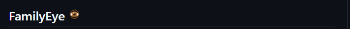

<div align="center">
  
  
  <br><br>

  
  <br><br>
  
  > **Inteligentní ochrana pro Vaši rodinu v digitálním světě**

  [](LICENSE)
  [](LICENSE_IMAGES)
  [](README.md)
  [](README_CZ.md)
  [](docs/AGENT.md)
</div>

---

## ⚡ Blesková Instalace & Nastavení
**Zapomeňte na složité konfigurace. Vše je připraveno pro okamžité použití.**

- 🐳 **Server (Docker):** Jediný příkaz `docker-compose up` a váš server běží.
- 🏢 **Server (Windows):** One-click instalátor pro domácí PC. Může běžet samostatně nebo spolu s agentem. Veškerý provoz je **šifrovaný by default**.
- 💻 **Agent Windows:** Jednoduchý instalátor, který za vás nastaví účet, oprávnění i služby.
- 📱 **Agent Android:**
  - **Bez ztráty dat!** Není potřeba tovární nastavení.
  - **Snadné párování:** Stačí naskenovat QR kód.
  - **Plná ochrana (Device Owner):** Nastavení na 3 klinkutí přes **WebUSB/WebADB**. Připojíte kabel, kliknete a máte hotovo.

---

## 🌟 Proč FamilyEye? Game Changer Features!

### 🛡️ Smart Shield & Detekce Slov (i Vlastních!)
**Nečekejte na problém, předcházejte mu.**
Náš unikátní **Smart Shield** neblokuje jen domény. Analyzuje obsah obrazovky v reálném čase:
- **Detekce nebezpečných slov** (včetně vašich **vlastních kategorií**!).
- **AI analýza vizuálů** a okamžité pořízení důkazního snímku.
- Funguje v jakékoliv aplikaci, nejen v prohlížeči.

### 🔒 Vaše Data v Bezpečí (Ani Čína, ani Amerika)
Soukromí je pro nás klíčové.
- **Self-hosted:** Celý systém běží na vašem vlastním železe.
- **Žádné sledování:** Vaše data neputují na cizí servery v Číně ani v USA. Vše zůstává u vás doma.

### 🎮 Kompletní Kontrola a Agenti
**To není jen o blokování. Je to o zdravých návycích.**

#### ⏰ Pánem Času (Limity a Rozvrhy)
- **Flexibilní Rozvrhy:** Nastavte přesně, kdy se smí hrát a kdy se spí ("Večerka").
- **Dávkování Zábavy:** Určete denní limity pro konkrétní aplikace nebo celé kategorie.
- **Školní Režim:** Během výuky jen povolené aplikace.

#### 🔒 Vzdálená Správa v Reálném Čase
- **Lock Down!** Potřebujete okamžitou pozornost? Uzamkněte zařízení dítěte na jedno kliknutí z vašeho mobilu.
- **Blokování Instalací:** Na Androidu a Windows zabráníte instalaci nežádoucích programů.
- **Webový Filtr:** Blokování stránek a vynucení bezpečného vyhledávání.

#### 🕵️‍♂️ Co se děje, když se nedíváte?
- **Detailní Reporting:** Přesné grafy používání aplikací (žádné "jen jsem se díval na hodiny").
- **Offline? Nevadí:** Agenti nahrávají aktivitu i offline a po připojení vše synchronizují.
- **Anti-Tamper Ochrana:** Dítě nemůže agenta jen tak odinstalovat nebo vypnout (Device Admin/Owner mód).

---

## 🚀 Chcete se zapojit? Nebo jste našli chybu?

**Chcete vylepšit funkce nebo opravit bug? Tak to jednoduše udělejte!**

Projekt je navržen tak, aby se do něj mohl zapojit každý – klidně s pomocí **AI**.
- **Pro AI Agenty:** V kořenu projektu najdete soubor [`llms.txt`](llms.txt).
- **Jak na to:** Jednoduše načtěte `llms.txt` svému AI agentovi (Claude, ChatGPT, Cursor). Soubor obsahuje kompletní kontext, architekturu a instrukce, takže AI okamžitě pochopí, co a jak upravit.

*Vytvářejte, upravujte a pomozte nám dělat digitální svět bezpečnějším!*

---

## 🛠️ Technická Dokumentace

*Níže naleznete technické detaily, strukturu projektu a návody na instalaci.*

## 📁 Project Structure

```
FamilyEye/
├── backend/           # FastAPI backend server
│   ├── app/           # Application code
│   │   ├── api/       # REST endpoints
│   │   ├── models/    # SQLAlchemy models
│   │   └── services/  # Business logic
│   └── requirements.txt
├── frontend/          # React dashboard
│   └── src/
│       ├── components/
│       └── services/
├── clients/
│   ├── android/       # Android agent (Kotlin)
│   └── windows/       # Windows agent (Python)
├── installer/         # Inno Setup installers
├── docs/              # Documentation
└── certs/             # SSL certificates
```

## 📚 Dokumentace

Kompletní dokumentace je organizována v adresáři `/docs`.

### 🧭 Hlavní Přehled
| Dokument | Popis |
|----------|-------------|
| **[INDEX](docs/INDEX.md)** | **Hlavní rozcestník dokumentace** |
| [Architecture](docs/ARCHITECTURE.md) | Přehled architektury systému |
| [Deployment](docs/DEPLOYMENT.md) | Příručka pro nasazení do produkce |
| [Development](docs/DEVELOPMENT.md) | Návod pro nastavení vývojového prostředí |

### 🧩 Komponenty
| Dokument | Popis |
|----------|-------------|
| [Backend Guide](docs/BACKEND.md) | Detailní popis backendu a služeb |
| [Frontend Guide](docs/FRONTEND.md) | Vývoj webového dashboardu |
| [Agents Guide](docs/AGENT.md) | Dokumentace pro Windows a Android agenty |
| [Database](docs/DATABASE.md) | Databázové schéma a správa dat |
| [API Reference](docs/API.md) | Specifikace REST API endpointů |

### 🔬 Deep Dives & Reference
- **Architektura:** [System Design](docs/architecture/system-design.md), [Security Model](docs/architecture/security-model.md)
- **Reference:** [Feature Matrix](docs/reference/feature-matrix.md), [Error Codes](docs/reference/error-codes.md), [Testing Guide](docs/reference/testing.md)
- **Diagramy:** [Synchronizace času](docs/TIME_SYNC_DIAGRAM.md)

### 🎓 Návody a Tutoriály
- **Začínáme:** [Prvotní nastavení](docs/tutorials/first-setup.md), [Průvodce startem](docs/tutorials/getting-started.md)
- **Řešení problémů:** [USB Debugging](docs/how-to/troubleshoot-usb.md), [Obnovení přístupu](docs/how-to/restore-access.md)
- **Běžné úkony:** [Změna PINu](docs/how-to/change-pin.md), [Odblokování aplikace](docs/how-to/unblock-app.md)

## 🤝 Contributing

We welcome contributions! Please see [CONTRIBUTING.md](CONTRIBUTING.md) for guidelines.

### Quick Contribution Guide

1. Fork the repository
2. Create a feature branch (`git checkout -b feature/amazing-feature`)
3. Commit your changes (`git commit -m 'Add amazing feature'`)
4. Push to the branch (`git push origin feature/amazing-feature`)
5. Open a Pull Request

## 🔐 Security

For security vulnerabilities, please see [SECURITY.md](SECURITY.md) or email security@familyeye.app (do not open public issues).

## 📄 License

### Code License
This project's **source code** is licensed under **GNU General Public License v3.0 (GPLv3)**.
See [LICENSE](LICENSE) file for details.

### Images License
All **images, graphics, and visual assets** in this repository are licensed under **Creative Commons Attribution-NonCommercial-ShareAlike 4.0 International (CC BY-NC-SA 4.0)**.
See [LICENSE_IMAGES](LICENSE_IMAGES) file for details.

**Author:** Róbert Pešout (BertSoftware) - robert.pesout@gmail.com

**Note:** Images are for non-commercial use only. For commercial use of images, please contact the author.

---

<p align="center">
  Made with ❤️ for families everywhere
</p>
