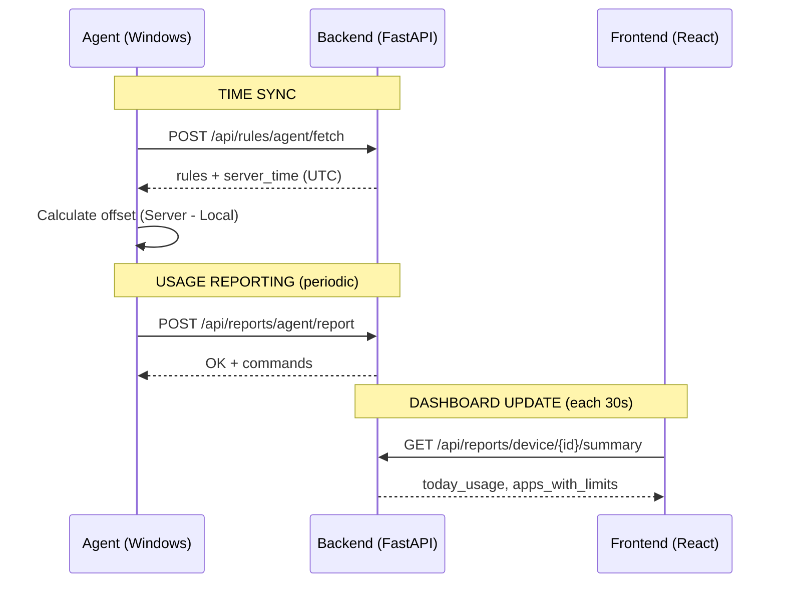
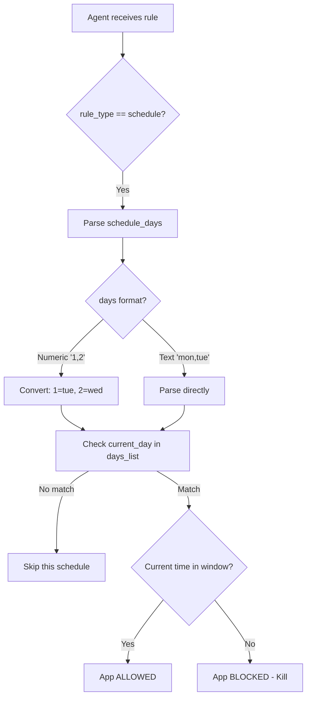

# Time Synchronization Architecture - Diagram

This document describes the time synchronization flow between the FamilyEye Agent, Backend, and Frontend.

## Time Sync Flow



**Interval reportování:** Na Androidu sync 60 s při zapnutém displeji; na Windows dle `reporting_interval` (typ. 300 s).

## Schedule Rule Processing



## Key Components

### Agent (enforcer.py)

- **`get_trusted_datetime()`** - Returns trusted local time based on server sync
- **`get_trusted_utc_datetime()`** - Returns trusted UTC time for timestamps
- **`_parse_schedule_days()`** - Parses days in both numeric and text formats

### Time Sync Properties

| Property | Description |
|----------|-------------|
| `ref_server_ts` | Server timestamp at sync moment |
| `ref_monotonic` | Monotonic clock at sync moment |
| `is_time_synced` | True if valid sync exists |
| `SYNC_MAX_AGE` | 3600s (1 hour) - sync expiration |

### Trusted Time Calculation

```python
elapsed = time.monotonic() - self.ref_monotonic
current_server_ts = self.ref_server_ts + elapsed
trusted_local = datetime.fromtimestamp(current_server_ts)
```

## Fixed Issues (2026-01-06)

1. **Days Parsing Bug**: Backend sends `days: "1"` (numeric), agent now correctly converts to `"tue"`
2. **Duplicate Break**: Removed dead code causing logic issues
3. **Device Schedule**: Applied same fix for device-level schedules
