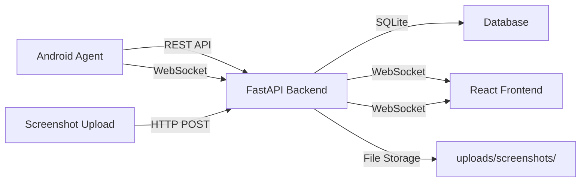
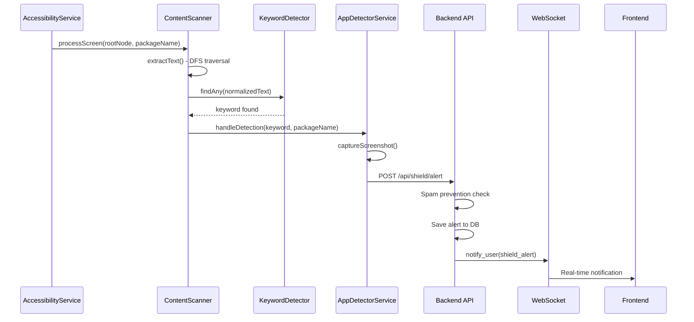
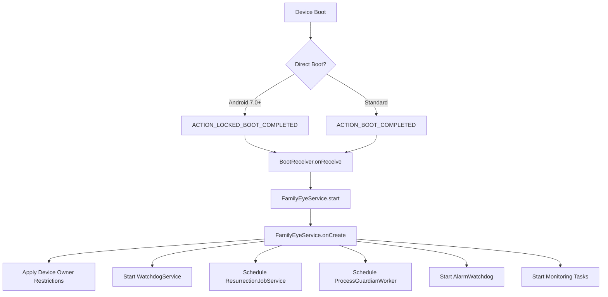
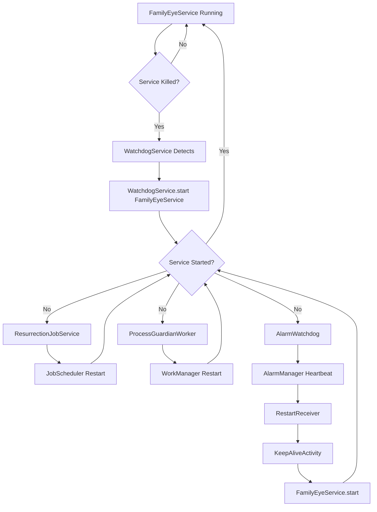
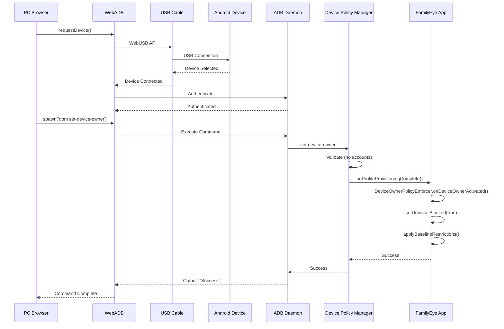
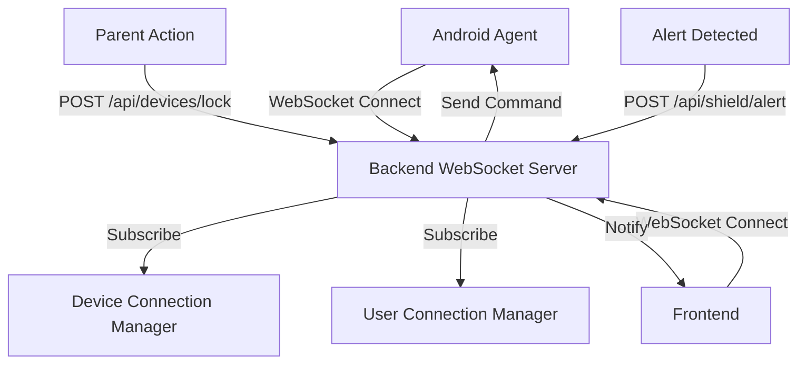
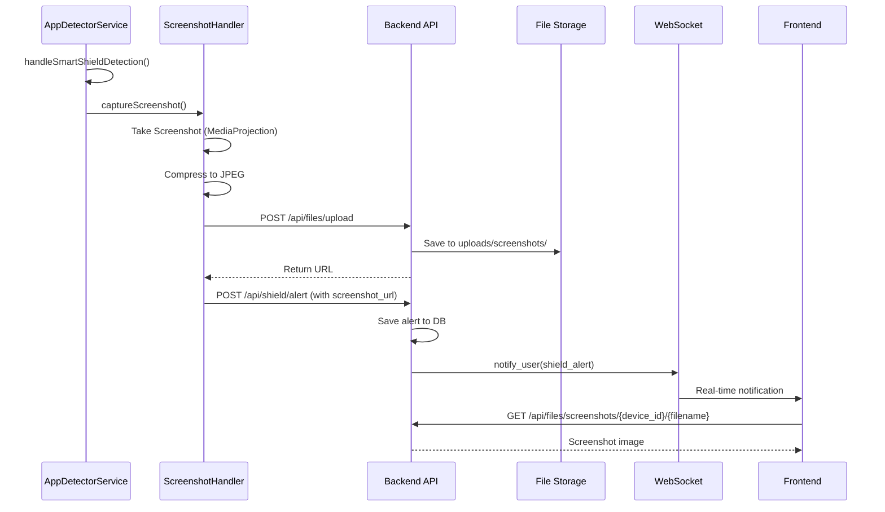

# System Design - Architektura systému

Hluboký technický popis architektury Smart Shield s Mermaid diagramy, toky dat a životním cyklem aplikace.

## Tok dat

### Hlavní tok: Android Agent -> Backend -> Frontend

### Detailní tok dat při detekci klíčového slova

## Životní cyklus aplikace

### Boot sequence

### Direct Boot vysvětlení

**Co je Direct Boot?**

Direct Boot je funkce Androidu 7.0+, která umožňuje aplikacím běžet **před odemknutím zařízení PINem**. To znamená, že Smart Shield může běžet i když je telefon zamčený.

**Proč aplikace přežije restart bez PINu?**

1. **ACTION_LOCKED_BOOT_COMPLETED** se spustí před odemknutím
2. `BootReceiver` zachytí tento intent
3. `FamilyEyeService.start()` se spustí v "direct boot" módu
4. Služba běží v šifrovaném úložišti, ale má přístup k Device Owner API

**Technický detail:**
- Aplikace musí mít `android:directBootAware="true"` v AndroidManifest.xml
- Data jsou uložena v `DeviceEncryptedStorage` (dostupné před odemknutím)
- Po odemknutí PINem se přepne na `CredentialEncryptedStorage`

**Zdroj**: `clients/android/app/src/main/AndroidManifest.xml`

### Service Start - Všechny inicializace

Po spuštění `FamilyEyeService.onCreate()` se provede:

1. **Foreground Service Notification** - Služba běží na popředí
2. **Device Owner Restrictions** - Aplikace baseline restrikcí
3. **Watchdog Service** - Spuštění watchdogu v separátním procesu
4. **JobScheduler Resurrection** - Naplánování obnovení služby
5. **WorkManager Guardian** - Backup recovery mechanismus
6. **Monitoring Tasks** - Spuštění sledovacích úloh
7. **Screen State Receiver** - Registrace receiveru pro screen on/off
8. **Watchdog Monitoring** - Vzájemné monitorování watchdogu
9. **Alarm Heartbeat** - Plánuje se při zapnutí displeje; při zhasnutí se zruší (smart watchdog, šetrnost k baterii)

**Zdroj**: `clients/android/app/src/main/java/com/familyeye/agent/service/FamilyEyeService.kt:onCreate()`

## Android Service Survival - Imunitní systém

### Flowchart: Co se stane při crash/kill

### Vrstvy persistence (5 vrstev)

1. **WatchdogService** (separate process `:watchdog`)
   - Kontroluje každých 5 sekund
   - Pokud hlavní služba není spuštěna, spustí ji
   - **Zdroj**: `clients/android/app/src/main/java/com/familyeye/agent/service/WatchdogService.kt`

2. **ResurrectionJobService** (JobScheduler)
   - Naplánováno každých 15 minut
   - Přežije app kill (JobScheduler běží na systémové úrovni)
   - **Zdroj**: `clients/android/app/src/main/java/com/familyeye/agent/service/ResurrectionJobService.kt`

3. **ProcessGuardianWorker** (WorkManager)
   - Backup recovery mechanismus
   - Naplánováno každých 15 minut (`GUARDIAN_WORKER_INTERVAL_MIN`)
   - Přežije app kill
   - **Zdroj**: `clients/android/app/src/main/java/com/familyeye/agent/service/ProcessGuardianWorker.kt`

4. **AlarmWatchdog** (AlarmManager, smart watchdog)
   - Interval heartbeat: 2 minuty při zapnutém displeji. Heartbeat se plánuje **jen při zapnutém displeji**. Při zhasnutém displeji RestartReceiver heartbeat neplánuje; FamilyEyeService při SCREEN_OFF volá `AlarmWatchdog.cancel()`, při SCREEN_ON volá `scheduleHeartbeat()`. Cíl: snížit „Často budí systém“ a spotřebu baterie. Self-revive (JobScheduler, WorkManager, onTaskRemoved) zůstává beze změny.
   - Pokud aplikace neodpovídá, spustí `RestartReceiver`
   - **Zdroj**: `clients/android/app/src/main/java/com/familyeye/agent/service/AlarmWatchdog.kt`

5. **KeepAliveActivity** (Activity-based restart)
   - Poslední záchrana
   - Spustí se z `RestartReceiver`
   - Zajistí spuštění služby a pak se ukončí
   - **Zdroj**: `clients/android/app/src/main/java/com/familyeye/agent/ui/KeepAliveActivity.kt`

## Device Owner Provisioning - Sequence Diagram

## WebSocket komunikace

### Real-time updates

**WebSocket endpoint**: `/ws/{device_id}`

**Příkazy odesílané na zařízení**:
- `LOCK_NOW` - Zamknutí
- `UNLOCK_NOW` - Odemknutí
- `REFRESH_RULES` - Obnovení pravidel
- `SCREENSHOT_NOW` - Pořízení screenshotu
- `DEACTIVATE_DEVICE_OWNER` - Deaktivace Device Owner
- `REACTIVATE_DEVICE_OWNER` - Reaktivace Device Owner

**Notifikace odesílané rodiči**:
- `shield_alert` - Detekce klíčového slova
- `device_status` - Změna stavu zařízení

**Zdroj**: `backend/app/api/websocket.py`

## Screenshot upload flow

## Technické reference

### Backend soubory

- `backend/app/main.py` - FastAPI aplikace, router registrace
- `backend/app/api/websocket.py` - WebSocket server
- `backend/app/api/shield.py` - Smart Shield endpointy
- `backend/app/api/reports/` - Report endpointy

### Android soubory

- `clients/android/app/src/main/java/com/familyeye/agent/receiver/BootReceiver.kt` - Boot receiver
- `clients/android/app/src/main/java/com/familyeye/agent/service/FamilyEyeService.kt` - Hlavní služba
- `clients/android/app/src/main/java/com/familyeye/agent/service/WatchdogService.kt` - Watchdog
- `clients/android/app/src/main/java/com/familyeye/agent/service/ResurrectionJobService.kt` - JobScheduler
- `clients/android/app/src/main/java/com/familyeye/agent/service/AlarmWatchdog.kt` - AlarmManager
- `clients/android/app/src/main/java/com/familyeye/agent/service/AppDetectorService.kt` - Accessibility Service

### Frontend soubory

- `frontend/src/services/websocket.js` - WebSocket klient
- `frontend/src/services/api.js` - REST API klient
- `frontend/src/components/DeviceOwnerSetup.jsx` - WebADB setup
