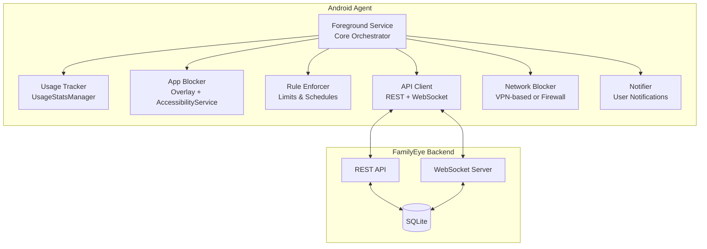

# FamilyEye Android Agent - Development Roadmap

Comprehensive plan for developing an Android parental control agent that integrates with the existing FamilyEye backend (Node.js + SQLite) and React Dashboard.

---

## User Review Required

> [!IMPORTANT]
> **Technology Stack Decision**: The plan proposes **Kotlin + Jetpack Compose** as the primary stack. This is optimal for modern Android development but requires Kotlin expertise. Alternative: Java-only approach using forked repositories.

> [!WARNING]
> **Device Owner Mode**: Full MDM capabilities (Device Owner) require **factory reset** or **ADB provisioning** on devices. This may not be suitable for all deployment scenarios. The roadmap includes a "Standard Mode" fallback.

> [!CAUTION]
> **Aggressive Permissions**: Since the app won't be on Google Play, we can use:
> - `SYSTEM_ALERT_WINDOW` (Overlay)
> - `QUERY_ALL_PACKAGES`
> - `PACKAGE_USAGE_STATS`
> - `AccessibilityService`
> - `DeviceAdminReceiver`
>
> These require explicit user consent during setup and may trigger Play Protect warnings.

---

## 1. Technology Stack Recommendation

### Core Stack
| Component | Choice | Rationale |
|-----------|--------|-----------|
| **Language** | Kotlin | Modern, null-safe, Google-recommended |
| **Min SDK** | 29 (Android 10) | Per requirement, supports 10-15 |
| **Target SDK** | 35 (Android 15) | Latest stable |
| **UI** | Jetpack Compose | Modern, less boilerplate |
| **DI** | Hilt | Standard for Android |
| **Networking** | OkHttp + Retrofit | Industry standard |
| **WebSocket** | OkHttp WebSocket | Same library, consistent |
| **Local Storage** | DataStore + Room | Modern preferences & DB |
| **Background** | WorkManager + Foreground Service | Battery optimization compliant |

### Key Android APIs
```
UsageStatsManager      → App usage tracking
AccessibilityService   → Real-time app detection & blocking
DeviceAdminReceiver    → Device-level controls
DevicePolicyManager    → Device Owner (MDM) features
WindowManager          → Overlay blocking UI
AlarmManager           → Precise scheduling
```

---

## 2. Open Source Repositories Analysis

### Primary Recommendations

#### [PranavPurwar/AppLock](https://github.com/PranavPurwar/AppLock) ⭐ **RECOMMENDED BASE**
| Aspect | Details |
|--------|---------|
| License | **MIT** (fully permissive) |
| Language | Kotlin |
| Relevance | Overlay lock, UsageStatsManager, Foreground Service, Boot receiver |
| Use Case | Fork as foundation for App Blocker module |
| Status | Active, modern codebase |

#### [AyanAhmedKhan381/KidSafe](https://ayanahmmedkhan381.github.io/KidSafe_Parental_Control_Android_App_using-Kotlin/)
| Aspect | Details |
|--------|---------|
| License | Check repo |
| Language | Kotlin |
| Relevance | Complete parental control: app blocks, screen time, location |
| Use Case | Reference architecture, feature inspiration |

#### [laasyasree/DigiPaws](https://github.com/laasyasree/DigiPaws)
| Aspect | Details |
|--------|---------|
| License | Open source |
| Language | Kotlin |
| Relevance | AccessibilityService blocking, anti-uninstall |
| Use Case | Reference for aggressive blocking techniques |

#### [android/enterprise-samples](https://github.com/android/enterprise-samples)
| Aspect | Details |
|--------|---------|
| License | Apache 2.0 |
| Language | Kotlin + Java |
| Relevance | Official Device Owner/MDM examples |
| Use Case | Reference for Device Policy implementation |

### Recommended Strategy


**Why PranavPurwar/AppLock as base:**
1. ✅ MIT License - no restrictions
2. ✅ Already has Overlay + UsageStats + Foreground Service
3. ✅ Modern Kotlin + Compose
4. ✅ Active maintenance
5. ✅ Anti-uninstall protection included

---

## 3. Agent Architecture Design

### High-Level Architecture


### Module Breakdown

#### 1. **Core Service** (`FamilyEyeService.kt`)
- Foreground Service with persistent notification
- Orchestrates all modules
- Survives Doze mode with `setForegroundServiceType(FOREGROUND_SERVICE_TYPE_DATA_SYNC)`
- Boot receiver for auto-start

#### 2. **Usage Tracker** (`UsageTracker.kt`)
- Polls `UsageStatsManager` every 5-10 seconds
- Tracks foreground app + duration
- Stores locally in Room DB
- Syncs to backend via Reporter

#### 3. **App Blocker** (`AppBlocker.kt`)
```kotlin
// Two-layer blocking:
// 1. AccessibilityService - Detects app launch, sends to background
// 2. Overlay Window - Displays "App Blocked" UI over screen
```

#### 4. **Rule Enforcer** (`RuleEnforcer.kt`)
- Fetches rules from backend (polling + WebSocket push)
- Evaluates: `app_limit`, `daily_limit`, `schedule`, `app_block`
- Triggers App Blocker when limits exceeded

#### 5. **API Client** (`ApiClient.kt`)
```kotlin
interface FamilyEyeApi {
    @POST("/api/agent/pair")
    suspend fun pair(request: PairingRequest): PairingResponse
    
    @GET("/api/agent/rules")
    suspend fun getRules(): AgentRulesResponse
    
    @POST("/api/agent/report")
    suspend fun report(request: AgentReportRequest): Response<Unit>
}
```

#### 6. **WebSocket Client** (`WebSocketClient.kt`)
- Persistent connection to `wss://backend/ws/agent`
- Handles real-time commands: `LOCK_NOW`, `UNLOCK`, `REFRESH_RULES`
- Auto-reconnect with exponential backoff

---

## 4. Implementation Roadmap

### Phase 0: Foundation (Week 1-2) 🏗️
**Goal**: "Hello World" that connects to backend

| Task | Description | Est. Hours |
|------|-------------|------------|
| 0.1 | Fork PranavPurwar/AppLock, strip unnecessary features | 4h |
| 0.2 | Setup project: Kotlin, Compose, Hilt, Retrofit | 4h |
| 0.3 | Implement `ApiClient` with pairing endpoint | 6h |
| 0.4 | Create QR code scanning activity (existing React QR works) | 4h |
| 0.5 | Secure storage for `device_id` + `api_key` (EncryptedSharedPrefs) | 4h |
| 0.6 | Basic Foreground Service that reports heartbeat | 6h |

**Deliverable**: APK that can scan QR, pair with backend, show "connected" status.

---

### Phase 1: Usage Tracking (Week 3-4) 📊
**Goal**: TrueFocus-style usage data collection

| Task | Description | Est. Hours |
|------|-------------|------------|
| 1.1 | Permission flow: `PACKAGE_USAGE_STATS` | 4h |
| 1.2 | `UsageStatsManager` polling every 5s | 8h |
| 1.3 | Local Room DB for usage_logs | 6h |
| 1.4 | Reporter module: batch sync to `/api/agent/report` | 6h |
| 1.5 | Offline queue with retry (like Windows agent) | 8h |
| 1.6 | App icon extraction + caching | 4h |
| 1.7 | **New:** "Data Saver" mode (Sync only on Wi-Fi) | 4h |
| 1.8 | **New:** Manual Sync implementation | 4h |

**Deliverable**: Dashboard shows Android device usage data.

---

### Phase 2: App Blocking (Week 5-7) 🚫
**Goal**: Functional app blocking with overlay

| Task | Description | Est. Hours |
|------|-------------|------------|
| 2.1 | `AccessibilityService` for real-time app detection | 10h |
| 2.2 | `SYSTEM_ALERT_WINDOW` overlay permission flow | 4h |
| 2.3 | Block overlay UI (Compose fullscreen) | 8h |
| 2.4 | Rule Enforcer: app_block, time_limit logic | 10h |
| 2.5 | Daily limit enforcement | 6h |
| 2.6 | Schedule enforcement (time-based blocks) | 8h |
| 2.7 | User notifications (limit warnings, blocks) | 6h |

**Deliverable**: Apps are blocked based on rules from dashboard.

---

### Phase 3: Real-Time Control (Week 8-9) ⚡
**Goal**: Instant commands from parent dashboard

| Task | Description | Est. Hours |
|------|-------------|------------|
| 3.1 | WebSocket client with OkHttp | 8h |
| 3.2 | Command handlers: `LOCK_NOW`, `UNLOCK`, `SCREENSHOT` | 6h |
| 3.3 | Implement `ScreenshotManager` using Accessibility API | 4h |
| 3.4 | Rule refresh on WebSocket push | 4h |
| 3.5 | Device lock screen overlay | 8h |

**Deliverable**: Parent can lock/unlock device instantly and take screenshots.

---

### Phase 4: Device Owner Mode (Week 10-12) 🔒
**Goal**: MDM-level control for maximum enforcement

| Task | Description | Est. Hours |
|------|-------------|------------|
| 4.1 | `DeviceAdminReceiver` implementation | 8h |
| 4.2 | Device Owner provisioning (QR + ADB methods) | 10h |
| 4.3 | Kiosk mode (Lock Task Mode) | 8h |
| 4.4 | Disable settings access | 6h |
| 4.5 | Prevent app uninstallation | 6h |
| 4.6 | Network policy (VPN-based or disable Wi-Fi) | 10h |
| 4.7 | Factory reset protection | 4h |

**Deliverable**: Enterprise-grade parental control with tamper protection.

---

## 5. Backend Modifications (Minimal)

The existing backend already supports Android devices!

### Existing Support
- ✅ `device_type: 'android'` in Device model
- ✅ Pairing API (`/api/devices/pair`)
- ✅ Rules API (`/api/agent/rules`)
- ✅ Usage reporting (`/api/agent/report`)
- ✅ WebSocket endpoint (`/ws`)

### Minor Additions Needed

#### [MODIFY] [devices.py](file:///c:/Users/Administrator/Documents/Cursor/Parential-Control_Enterprise/backend/app/api/devices.py)
- Add Android-specific device info fields (battery, Android version)

#### [MODIFY] [schemas.py](file:///c:/Users/Administrator/Documents/Cursor/Parential-Control_Enterprise/backend/app/schemas.py)
```python
class AgentReportRequest(BaseModel):
    # ... existing fields ...
    battery_level: Optional[int] = None        # NEW
    android_version: Optional[str] = None      # NEW
    screen_on: Optional[bool] = None           # NEW
```

---

## 6. Proposed Directory Structure

```
clients/
├── windows/           # Existing Windows agent
└── android/           # NEW Android agent
    ├── app/
    │   └── src/main/
    │       ├── java/com/familyeye/agent/
    │       │   ├── di/                    # Hilt modules
    │       │   ├── data/
    │       │   │   ├── api/               # Retrofit interfaces
    │       │   │   ├── db/                # Room database
    │       │   │   └── repository/        # Data repositories
    │       │   ├── domain/
    │       │   │   ├── model/             # Domain models
    │       │   │   └── usecase/           # Business logic
    │       │   ├── service/
    │       │   │   ├── FamilyEyeService.kt
    │       │   │   ├── UsageTracker.kt
    │       │   │   ├── AppBlocker.kt
    │       │   │   └── RuleEnforcer.kt
    │       │   ├── ui/
    │       │   │   ├── setup/             # Pairing flow
    │       │   │   ├── overlay/           # Block overlay
    │       │   │   └── settings/          # Agent settings
    │       │   ├── receiver/
    │       │   │   ├── BootReceiver.kt
    │       │   │   └── DeviceAdminReceiver.kt
    │       │   └── FamilyEyeApp.kt
    │       ├── res/
    │       └── AndroidManifest.xml
    ├── build.gradle.kts
    └── README.md
```

---

## 7. Verification Plan

### Automated Testing
Since this is a new Android project, automated testing will be set up as part of development:

1. **Unit Tests** (JUnit + MockK)
   - `UsageTracker` logic
   - `RuleEnforcer` decision making
   - `ApiClient` serialization

2. **Instrumented Tests** (Espresso + UI Automator)
   - Pairing flow
   - Overlay display
   - Permission grants

3. **Integration Tests**
   - Backend connectivity (requires running backend)

### Manual Verification

#### Phase 0 Verification
1. Install APK on Android 10+ device
2. Open React dashboard → Devices → Generate QR
3. Scan QR with Android agent
4. Verify device appears in dashboard as "Online"

#### Phase 1 Verification
1. Use various apps on child device for 5 minutes each
2. Check dashboard → Overview → verify usage bars match
3. Toggle airplane mode → use apps → reconnect
4. Verify offline usage syncs correctly

#### Phase 2 Verification
1. Dashboard → Rules → Create app limit (e.g., YouTube 5 min)
2. Use YouTube on child device
3. Verify warning notification at 70%
4. Verify block overlay at 100%
5. Verify app returns to launcher

#### Phase 3 Verification
1. Dashboard → Devices → Click "Lock Device"
2. Verify child device shows lock screen immediately
3. Dashboard → Unlock
4. Verify device unlocks

#### Phase 4 Verification
1. Provision device as Device Owner via ADB:
   ```
   adb shell dpm set-device-owner com.familyeye.agent/.receiver.DeviceAdminReceiver
   ```
2. Verify Settings access is blocked
3. Verify agent cannot be uninstalled
4. Verify kiosk mode locks to specific apps

---

## 8. Risk Assessment

| Risk | Mitigation |
|------|------------|
| Android version fragmentation | Test on Android 10, 12, 14, 15 emulators |
| Battery drain from constant polling | Use WorkManager for non-critical tasks |
| Play Protect warnings | Document disable steps, provide instructions |
| Doze mode killing service | Use high-priority FCM for wake-up |
| Child bypassing via Safe Mode | Device Owner mode prevents Safe Mode |

---

## 9. Estimated Timeline

| Phase | Duration | Cumulative |
|-------|----------|------------|
| Phase 0: Foundation | 2 weeks | Week 2 |
| Phase 1: Usage Tracking | 2 weeks | Week 4 |
| Phase 2: App Blocking | 3 weeks | Week 7 |
| Phase 3: Real-Time | 2 weeks | Week 9 |
| Phase 4: Device Owner | 3 weeks | Week 12 |

**Total: ~12 weeks (3 months)** for full implementation.

---

## 10. Next Steps

1. **Approve this roadmap**
2. Fork PranavPurwar/AppLock into project
3. Start Phase 0 implementation
4. Create `clients/android/` directory structure
5. Implement basic pairing flow

