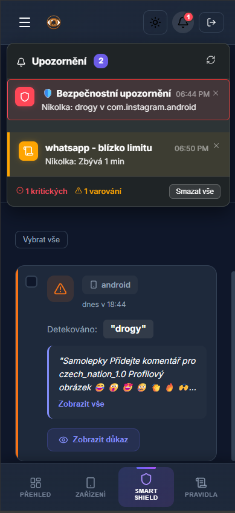
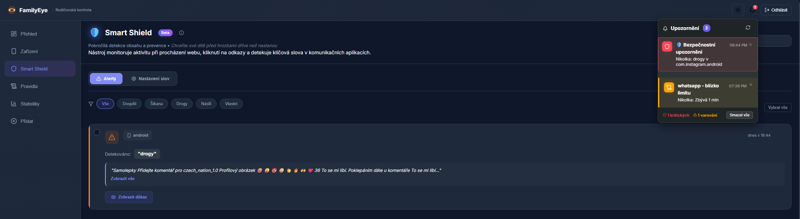

# Instalace Android Agenta

Průvodce instalací a aktivací FamilyEye agenta na Android telefonu dítěte.

## Přehled

Android agent poskytuje:
- **Monitorování aplikací** - sledování času v aplikacích
- **Smart Shield** - detekce škodlivého obsahu v reálném čase
- **Device Owner ochrana** - nelze odinstalovat bez souhlasu rodiče
- **Real-time notifikace** - okamžité upozornění rodičům

---

## Krok 1: Příprava telefonu

> [!WARNING]
> Pro plnou funkčnost (Device Owner) doporučujeme instalovat na **továrně resetované zařízení** (bez přihlášených Google účtů).

### Požadavky

- Android 7.0+ (pro Direct Boot podporu)
- Povolené **Ladění USB** ve vývojářských možnostech
- Pro Xiaomi/HyperOS: Povolené **Ladění USB (Bezpečnostní nastavení)**

### Postup přípravy

1. Zapněte telefon a přeskočte přihlášení k Google účtu (pokud je to možné)
2. Povolte **Ladění USB** ve vývojářských možnostech:
   - Nastavení → O telefonu → 7x klepněte na **Číslo sestavení**
   - Nastavení → Možnosti pro vývojáře → Zapněte **Ladění USB**
3. Viz [Getting Started](./getting-started.md) pro detailní instrukce

---

## Krok 2: Instalace Aplikace

### Stažení APK

1. Na telefonu otevřete prohlížeč
2. Přejděte na adresu z dashboardu nebo naskenujte QR kód ze sekce **Stáhnout**
3. Stáhněte `.apk` soubor

### Instalace

1. Povolte instalaci z neznámých zdrojů (systém vás vyzve)
2. Nainstalujte aplikaci **FamilyEye Agent**
3. Po instalaci aplikaci **zatím nespouštějte** - nejprve aktivujte Device Owner

---

## Krok 3: Aktivace Device Owner

> [!IMPORTANT]
> Device Owner musí být aktivován **před prvním spuštěním aplikace** pro plnou ochranu.

1. Připojte telefon k počítači pomocí USB kabelu
2. V dashboardu přejděte na **Průvodce nastavením** (Device Owner Setup)
3. Klikněte na **Připojit zařízení** a vyberte telefon
4. Klikněte na **Aktivovat Device Owner**
5. Počkejte na potvrzení úspěšné aktivace

Detailní návod s řešením problémů viz [Getting Started - Device Owner](./getting-started.md#krok-3-aktivace-device-owner).

---

## Krok 4: Párování

1. Spusťte aplikaci FamilyEye Agent na telefonu
2. V dashboardu vygenerujte **Pairing Token** (Přidat zařízení)
3. Na telefonu:
   - Naskenujte **QR kód** z dashboardu
   - Nebo zadejte token ručně
4. Potvrďte oprávnění, která aplikace vyžaduje:
   - **Accessibility Service** - pro detekci aplikací a Smart Shield
   - **Notification Access** - pro zobrazení notifikací
   - **Display over other apps** - pro overlay blokování

---

## Krok 5: Konfigurace a Dokončení

Po úspěšném spárování:

1. Zařízení se objeví v přehledu dashboardu
2. Nastavte **PIN pro admin přístup** na telefonu
3. **Nakonfigurujte Smart Shield** (volitelné):
   - V dashboardu přejděte na detaily zařízení
   - V sekci "Smart Shield" přidejte klíčová slova k monitorování (např. "drogy", "hazard")
   - Funkce je integrována přímo v agentovi a aktivuje se okamžitě po přidání pravidel

### Ověření Funkčnosti

Dashboard zobrazuje notifikace a alerty v reálném čase.

---

## Co dál?

- [First Setup](./first-setup.md) - Prvotní konfigurace pravidel a Smart Shield
- [Troubleshoot USB](../how-to/troubleshoot-usb.md) - Řešení problémů s USB připojením
- [Feature Matrix](../reference/feature-matrix.md) - Kompletní přehled funkcí

---

## Technické detaily

### Oprávnění aplikace

| Oprávnění | Účel |
|-----------|------|
| Accessibility Service | Detekce aplikací, Smart Shield skenování |
| Device Admin | Device Owner ochrana |
| Notification Access | Notifikace a alerty |
| Usage Access | Statistiky použití |
| Overlay | Blokování aplikací |
| Location | Poloha zařízení (volitelné) |

### Persistence

Agent používá 5-vrstvý imunitní systém pro zajištění nepřetržitého běhu:
- WatchdogService (separate process)
- ResurrectionJobService (JobScheduler)
- ProcessGuardianWorker (WorkManager)
- AlarmWatchdog (AlarmManager)
- KeepAliveActivity

Detaily viz [Security Model](../architecture/security-model.md).
